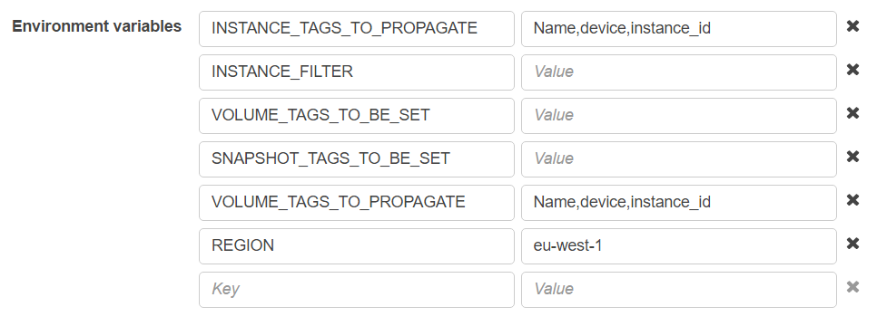

# Lambda Graffiti Monkey

An AWS Lambda function to run [Graffiti Monkey](https://github.com/Answers4AWS/graffiti-monkey) serverless. This function works great when triggered by a CloudWatch Events scheduled rule.

## Quickstart

1. Download the latest zipped Lambda function from the [releases page](https://github.com/joseph-holland/lambda-graffiti-monkey/releases).
2. Create a new Lambda function and upload the zip as the source (from AWS Console or cli, etc.)
3. Create environment variables and set to desired values

4. Now you can test the function

## Local Installation (mainly for test/development purposes)

Begin by creating a new virtualenv and installing the required python modules:

```sh
$ cd lambda-graffiti-monkey
$ virtualenv -p /usr/bin/python2.7 graffiti-monkey
$ source graffiti-monkey/bin/activate
(graffiti-monkey) $ pip install -r requirements.txt
```

### Running locally (using python-lambda)

First we need to set some environment variables for Graffiti Monkey to use, so just paste the below into your shell setting tags as required:

```sh
(graffiti-monkey) $ export REGION="eu-west-1"
(graffiti-monkey) $ export SNS_ARN="arn:aws:sns:eu-west-1:123456654321:lambda-graffiti-monkey"
(graffiti-monkey) $ export INSTANCE_TAGS_TO_PROPAGATE="Name,device,instance_id"
(graffiti-monkey) $ export VOLUME_TAGS_TO_PROPAGATE="Name,device,instance_id"
(graffiti-monkey) $ export VOLUME_TAGS_TO_BE_SET=""
(graffiti-monkey) $ export SNAPSHOT_TAGS_TO_BE_SET=""
(graffiti-monkey) $ export INSTANCE_FILTER=""
```

Now we can just execute the function using the [python-lambda](https://github.com/nficano/python-lambda) tool:

```sh
(graffiti-monkey) $ lambda invoke -v
INFO:service:Loading function
INFO:graffiti_monkey.core:Connecting to region eu-west-1 using profile None
INFO:graffiti_monkey.core:Getting list of all volumes
INFO:graffiti_monkey.core:Found 3 volumes
INFO:graffiti_monkey.core:Processing volume 1 of 3 total volumes
INFO:graffiti_monkey.core:Tagging vol-029e0e597169c31cf with [instance_id: i-099f436b19277b1bf]
INFO:graffiti_monkey.core:Tagging vol-029e0e597169c31cf with [device: /dev/sdb]
INFO:graffiti_monkey.core:Tagging vol-029e0e597169c31cf with [Name: Web01]
INFO:graffiti_monkey.core:Processing volume 2 of 3 total volumes
INFO:graffiti_monkey.core:Tagging vol-009215e7f776fd076 with [instance_id: i-099f436b19277b1bf]
INFO:graffiti_monkey.core:Tagging vol-009215e7f776fd076 with [device: /dev/sdc]
INFO:graffiti_monkey.core:Tagging vol-009215e7f776fd076 with [Name: Web01]
INFO:graffiti_monkey.core:Processing volume 3 of 3 total volumes
INFO:graffiti_monkey.core:Tagging vol-0a42428577e79f0e3 with [instance_id: i-099f436b19277b1bf]
INFO:graffiti_monkey.core:Tagging vol-0a42428577e79f0e3 with [device: /dev/xvda]
INFO:graffiti_monkey.core:Tagging vol-0a42428577e79f0e3 with [Name: Web01]
INFO:graffiti_monkey.core:Completed processing all volumes
INFO:graffiti_monkey.core:Getting list of all snapshots
INFO:graffiti_monkey.core:Found 0 snapshots
INFO:graffiti_monkey.core:Completed processing all snapshots
Graffiti Monkey completed successfully!

execution time: 1.41162705s
function execution timeout: 15s
```

### Creating Lambda function bundle

```sh
(graffiti-monkey) $ lambda build
Gathering pip packages
Installing appdirs==1.4.3
Installing boto==2.47.0
Installing boto3==1.4.1
Installing botocore==1.4.61
Installing click==6.6
Installing docutils==0.12
Installing futures==3.0.5
Installing graffiti-monkey==0.9.0
Installing jmespath==0.9.0
Installing packaging==16.8
Installing pip==9.0.1
Installing pyaml==15.8.2
Installing pyparsing==2.2.0
Installing python-dateutil==2.5.3
Installing python-lambda==0.5.0
Installing PyYAML==3.11
Installing s3transfer==0.1.10
Installing setuptools==35.0.2
Installing six==1.10.0
Installing wheel==0.29.0
Installing wsgiref==0.1.2
````

This will create a new zip file under the `dist` folder.  This file can now be uploaded to Lambda as the function source.
